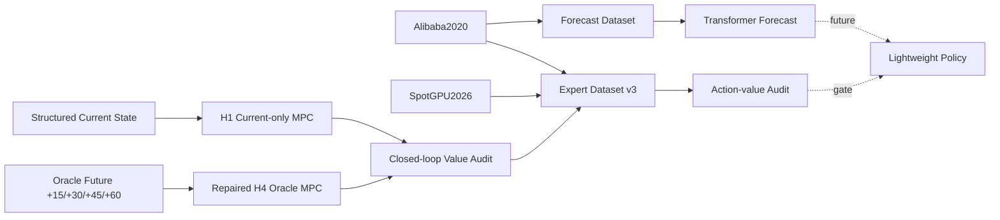

> 竞赛团队本地部署与协作开发请先阅读 [README_TEAM.md](README_TEAM.md)。

# 面向能源协同优化的多数据中心 AI 任务调度

*Energy-Aware Multi-Datacenter AI Task Scheduling*

本项目研究多数据中心环境下 AI 任务在不同数据中心之间的空间调度，以及在约束条件下的延迟执行问题，重点探索工作负载预测、模型预测控制（MPC）和轻量学习策略之间的合理分工。

- 当前研究分支：`feature/baseline-repair-information-contract-v1`
- 冻结里程碑：`c83515bf977494d5610197dfd2faa9d19af62d46`
- 里程碑 tag：`research-v3-expert-control-value-20260906`

当前核心研究问题：

> 哪些前瞻动作真正值得学习？

Transformer 负责未来 workload 预测；H1 表示只基于当前状态的优化；repaired H4 Oracle 使用真实未来信息，作为离线前瞻专家和价值分析上界。MPC 不再被简单定位为唯一在线控制器，学习策略也尚未进入当前正式下一阶段。

## 1. 项目简介

项目面向 geo-distributed multi-datacenter AI task scheduling。任务到达后的联合动作包括：

- `defer`：在冻结 SLA 允许范围内延迟执行。
- `DC1` 至 `DC5`：选择目标数据中心进行 placement。

当前数据处理和仿真采用 900 秒，即 15 分钟粒度。该粒度来自当前 workload 合同与实验设计，不代表普适的数据中心调度周期。

评价目标分别覆盖：

- CPU、GPU、Memory resource feasibility
- HP / Spot SLA
- electricity 与 carbon
- transmission 与 migration
- waiting、backlog 与 completion

项目严格区分预测精度、动作差异和真实闭环控制收益。这三类证据不能互相替代。

## 2. 研究问题

### Q1：未来 workload 是否可预测？

在严格时间切分和无未来泄漏的前提下，比较 Persistence 与 Transformer 对未来 15 至 60 分钟负载的预测能力。

### Q2：看得更远的 MPC 是否真的有价值？

比较 current-only H1、Oracle H4 和可部署预测驱动的 H4，分别检查平均收益、敏感状态和闭环稳定性。

### Q3：哪些前瞻动作值得学习？

当 H1 与 H4 动作不同时，需要进一步区分 H4 genuinely better、near-equivalent action 和 H4 harmful。动作分歧率不能直接解释为控制收益。

### Q4：未来是否可以使用轻量策略？

候选方向是：

```text
当前完整状态 + 可部署预测 -> 轻量策略
```

该方向必须通过 action-value audit 后才能进入正式策略学习，当前不以机械模仿 H4 为既定路线。

## 3. 当前研究路线



```text
多数据中心 AI 任务调度
  -> 工作负载预测
  -> MPC 前瞻价值分析
  -> 在线长时域 MPC 平均收益有限
  -> MPC 转为离线专家 / 教师
  -> 学生状态表示审计与修复
  -> Alibaba2020 + SpotGPU2026 双任务级场景
  -> MPC Expert Dataset v3
  -> SpotGPU2026 H1/H4 闭环控制价值分析
  -> 哪些前瞻动作真正值得学习？
```

## 4. 数据来源与场景边界

### 4.1 Alibaba2020

用途包括原始机制开发、2020 baseline、Transformer workload forecast、repaired MPC 和 Expert Dataset v3 Scenario A。

所谓 `full year` workload 实际由一个 49-day cycle 重复构造，不是独立的完整年度 workload。预测实验只使用经过审计的 first unique 49 days，避免重复周期跨 split 泄漏。

### 4.2 SpotGPU2026

用途包括现代 task-level workload、从 `submit_time` 恢复 task arrivals、Expert Dataset v3 Scenario B 和 H1/H4 独立闭环控制价值评估。

当前冻结事实：

- 466,867 jobs
- 4,278 nodes
- 10,412 GPUs
- CPU/GPU request scope：`PER_JOB`
- `arrival_step = floor(submit_time / 900)`
- `true_duration`：仅 simulator 使用
- host memory：原始数据未直接测量，当前为 `MODELED_DC_MEMORY`
- bandwidth：modeled
- origin DC：modeled deterministic mapping
- GPU model：metadata-only，不作为当前兼容约束

5DC 容量来自完整 `node_info` 的确定性守恒分区，不对 workload 做删除、抽样或任务请求缩放。

### 4.3 Alibaba GPU2026 Main Trace

该 trace 与 SpotGPU2026 task-level trace 必须区分。当前用途是 hourly external realism、scenario validation、workload type 与 GPU-model realism，不用于精确的 task-level 15-minute arrival reconstruction。

### 4.4 External Energy Signal

SpotGPU2026 不提供当前实验所需的完整多区域 electricity price 与 carbon intensity。当前区域能源信号来自：

`SustainCluster 2023 EXTERNAL_SCENARIO_SIGNAL`

Spot 能源结论只适用于当前冻结的外部能源信号场景，不能表述为 Alibaba2026 实测电价或实测碳强度。

## 5. 方法角色

| 模块 | 当前角色 | 信息边界 |
|---|---|---|
| Transformer | 使用 96 steps 历史预测未来 4 steps workload | 可部署预测，不直接证明控制收益 |
| H1 | current-only optimization baseline | 只读取当前可部署状态 |
| Repaired H4 Oracle | 离线专家、上界与价值分析 | 使用真实 +15/+30/+45/+60 min future |
| MPC | 优化基线、离线教师、固定状态价值评估 | 不预设为唯一在线控制器 |
| Learning policy | action-value audit 后的候选方向 | 当前未启动新 BC/RL 路线 |

旧 BC、BC v2 和 SAC 结果保留为研究证据，但不再把“复制 H4”写成当前既定主线。

## 6. 当前关键研究结果

### 6.1 Transformer Forecast

数据范围为 Alibaba2020 first unique 49 days；history 为 96 steps（24 h），horizon 为 4 steps。

GPU-demand MAE：

| Horizon | Persistence | Transformer |
|---:|---:|---:|
| +15 min | 69.8064 | 54.7504 |
| +30 min | 74.6295 | 54.3934 |
| +45 min | 80.9823 | 54.2142 |
| +60 min | 74.7918 | 52.6491 |

+60 min MAE 相对改善约 29.61%。这说明未来 workload 具有可预测性，但更好的预测没有自动转化为明显更好的在线 MPC 平均收益。峰值误差与控制链路仍需单独评价。

### 6.2 Alibaba2020 Repaired MPC

H1 与 repaired H4 Oracle 的平均 stage-cost 差异约为 0.019%。

> 在线长时域 MPC 的平均价值有限，但前瞻信息可以在部分敏感状态改变 placement。

MPC 仍然是约束一致的优化基线、离线教师和动作价值分析工具。

### 6.3 当前状态表示修复

| 表示 | H1 动作学习结果 |
|---|---:|
| Current34 | 约 75.97% |
| CurrentDense | 约 96.11% |
| StructuredCurrent | 约 97.16% |

主要诊断是：瓶颈主要来自当前状态特征不完整，而不是必须采用更复杂的集合网络。

### 6.4 MPC Expert Dataset v3

| Scenario | States | Task decisions | H1/H4 task disagreement |
|---|---:|---:|---:|
| Alibaba2020 repaired | 7,680 | 259,920 | 3.679978% |
| SpotGPU2026 native-medium | 17,670 continuous | 466,867 | 26.244091% |

SpotGPU2026 补充结果：

- state any-disagreement：64.264281%
- high-risk task disagreement：39.629803%
- high-risk state disagreement：96.956246%
- H1 defer：0%
- H4 defer：0%

Spot 的分歧全部来自空间 placement，而不是 defer。

正式状态：`MPC EXPERT DATASET v3 READY WITH DOCUMENTED LIMITATIONS`。

详见 [Expert Dataset v3 摘要](artifacts/mpc_expert_dataset_v3/62_mpc_expert_dataset_v3_summary.md)。

### 6.5 SpotGPU2026 闭环控制价值

H1 和 H4 使用相同 workload、容量、SLA、能源与网络信号，从 step 0 连续运行 17,670 steps，并分别维护独立 simulator state。

| 指标 | H1 | H4 Oracle | H4 - H1 |
|---|---:|---:|---:|
| Total stage cost | 4,320,505.30676 | 4,323,847.57241 | +3,342.26565 |
| Relative stage cost | 基准 | +0.077358212% | 略差 |
| Electricity cost | 2,355,048.71 USD | 2,353,869.20 USD | -1,179.51 USD |
| Carbon | 5,384,361.55 kgCO2 | 5,400,113.81 kgCO2 | +15,752.27 kgCO2 |
| SLA violation rate | 40.5064% | 40.7842% | 略差 |
| Migration count | 340,979 | 342,073 | +1,094 |

daily blocks 中 H4 stage cost 更优的比例约为 21.08%，尾部排空不改变判断。

最终诊断：`CONTEXT_DEPENDENT_CONTROL_VALUE`。

> SpotGPU2026 中未来信息显著改变空间放置决策，但动作变化没有自动转化为稳定的综合控制收益。

高风险状态只表示 H1/H4 动作分歧更集中，不等同于 H4 在这些状态中产生正控制价值。

详见 [Spot 控制价值摘要](artifacts/spotgpu2026_control_value_v1/28_summary.md)。

## 7. 当前核心结论

1. 未来 workload 可以预测。
2. 更准确的预测不保证在线 MPC 平均收益显著提高。
3. 前瞻动作的影响具有明显状态依赖性，其正控制价值仍需进一步识别。
4. 在各自 source-matched frozen capacity scenario 下，SpotGPU2026 的 H1/H4 动作分歧高于 Alibaba2020。
5. 大量前瞻动作差异没有形成稳定正收益。
6. 当前重点从“如何模仿 H4”转为“哪些 H4 前瞻动作真正值得学习”。

这些证据只支持条件性结论，不支持把某个控制器描述为普遍更优，也不能把跨数据集观察解释为 workload 难度的因果证据。

## 8. 研究状态

| 模块 | 状态 | 当前结论 |
|---|---|---|
| Alibaba2020 数据合同 | 完成 | repaired；识别 49-day repeated cycle |
| Transformer v1 | 完成 | 平均 forecast 优于 Persistence |
| H1/H4 MPC | 完成 | average long-horizon gain limited |
| State representation repair | 完成 | current information bottleneck 已修复 |
| SpotGPU2026 contract | 完成 | native capacity ready |
| Expert Dataset v3 | 完成 | formal expert foundation |
| Spot closed-loop value | 完成 | context dependent |
| Action-value audit | 下一步 | pending |
| Spot forecast | 下一步 | pending |
| Lightweight policy | 暂缓 | depends on value audit |
| RL | 暂缓 | not current priority |

## 9. 下一阶段

1. **前瞻动作价值审计**：在共同反事实后续控制下，比较 H1/H4 不同第一步联合动作的实际多步代价，识别哪些前瞻动作真正产生正控制价值。
2. **有价值状态特征分析**：研究正 action value 与 pressure、energy、queue、release、task type 和 priority 的关系。
3. **SpotGPU2026 workload forecast**：评价 +15/+30/+45/+60 min prediction，不接 MPC、BC 或 RL。
4. **跨数据集分析**：描述 Alibaba2020 与 SpotGPU2026 的 workload / scheduling 差异，不做难度因果判断。

详细任务边界、分支和验收标准见 [下一阶段团队研究任务](docs/TEAM_TASKS.md)。

## 10. 项目结构

当前研究主线：

- `src/sustaincluster_contract/`：workload、runtime 与 information contract。
- `src/forecasting/`：forecast dataset、Transformer、inference 与 evaluation。
- `src/sustaincluster_mpc/`：状态适配、H1/H4、future signal、timeline 与 Triggered MPC 支持。
- `src/sustaincluster_imitation/`：expert dataset、current-state representation 与历史策略实验支持。
- `configs/`：场景、预测、MPC、imitation 和历史 RL 配置。
- `scripts/audit/`：数据、信息、MPC formulation、容量和场景审计。
- `scripts/forecast/`：forecast dataset、Transformer 与 forecast-aware MPC 入口。
- `scripts/imitation/`：Expert Dataset v2/v3、表示诊断与历史 BC v2 入口。
- `scripts/analysis/`：闭环控制价值和后续价值分析入口。
- `tests/`：单元、契约、回归和阶段验收测试。
- `artifacts/`：本地产物；Git 仅保留明确选择的小型协议、schema、统计、manifest 与 diagnosis。
- `docs/`：使用、架构、数据政策和团队协作文档。
- `references/external_repos/`：只读参考仓库，本体不进入主仓库 Git。

Legacy / compatibility：

- `src/datacenter_env/`：历史单中心热电环境。
- `models/`、`optimization/`、`evaluation/`、`experiments/`：历史兼容入口。
- `external_workloads/`：外部 workload provider 兼容层。
- `external_signals/`：外部能源信号 provider。

这些目录继续接受回归测试，但不是当前 SpotGPU2026 研究的默认入口。

## 11. 快速开始

### 11.1 克隆研究分支

```powershell
git clone https://github.com/sins1029/ai_system_collaboration.git
cd ai_system_collaboration
git switch feature/baseline-repair-information-contract-v1
```

### 11.2 准备固定 SustainCluster

```powershell
powershell -ExecutionPolicy Bypass -File .\scripts\clone_reference_repos.ps1
```

默认固定到 `3f6ea95cb835b89ba50b0ef76d66d14b8037643e`。其余四个参考仓库不是运行主线依赖，需要时使用：

```powershell
powershell -ExecutionPolicy Bypass -File .\scripts\clone_reference_repos.ps1 -AllReferences
```

### 11.3 创建环境

```powershell
powershell -ExecutionPolicy Bypass -File .\scripts\setup_env.ps1 -PythonPath python
..venv-sustain-cluster\Scripts\python.exe -m pip check
```

要求 Python 3.10+。脚本安装 SustainCluster 依赖，并以 `research,test` 模式安装本项目。

### 11.4 准备 Alibaba2020 Workload

公开仓库不包含原始 workload。具备合法本地来源后执行：

```powershell
..venv-sustain-cluster\Scripts\python.exe .\scripts\prepare_workload.py
..venv-sustain-cluster\Scripts\python.exe .\scripts\prepare_workload.py --check
```

也可通过 `--source`、`SUSTAINCLUSTER_WORKLOAD` 或 `SUSTAINCLUSTER_ROOT` 指定本地来源。详见 [数据准备说明](docs/数据准备说明.md)。

### 11.5 运行测试

```powershell
..venv-sustain-cluster\Scripts\python.exe .\scripts\run_tests.py
```

当前研究分支通过完整回归测试。最近一次 Spot control-value validation 为 `407 passed, 0 new failures`。该数量对应当前阶段，不作为未来版本的固定承诺。

## 12. 数据与许可

Git 仓库不包含：

- Alibaba raw traces
- SpotGPU2026 raw `job_info` / `node_info`
- Alibaba GPU2026 raw traces
- full Expert Dataset v3 Parquet
- privileged future dataset
- 完整 task-level / state-level 派生数据
- 大型 checkpoints 与新模型权重

公开内容主要为 source code、configs、schemas、protocols、small statistics、hash manifests 和 summary / diagnosis。

SpotGPU2026 派生数据的 public redistribution permission 当前为 `NOT_CONFIRMED`。仓库不提供完整 Expert Dataset v3 下载，也不表示这些派生数据已获公开再分发许可。历史兼容的小型 checkpoint 如仍被跟踪，不代表后续模型权重可以直接公开。

## 13. 团队协作与文档

团队采用 `milestone baseline + task branch + pull request`：

- [当前团队任务计划](docs/TEAM_TASKS.md)
- [历史里程碑 handoff](docs/team_handoff_20260906.md)
- [使用说明](docs/使用说明.md)
- [数据准备说明](docs/数据准备说明.md)
- [架构说明](docs/架构说明.md)
- [开发说明](docs/开发说明.md)
- [Spot 场景合同摘要](artifacts/spotgpu2026_scenario_contract_v1/29_summary.md)

组员从统一 milestone 创建独立 task branch，通过独立测试和 PR 合并。不要长期直接修改 `main` 或冻结 feature 分支。
