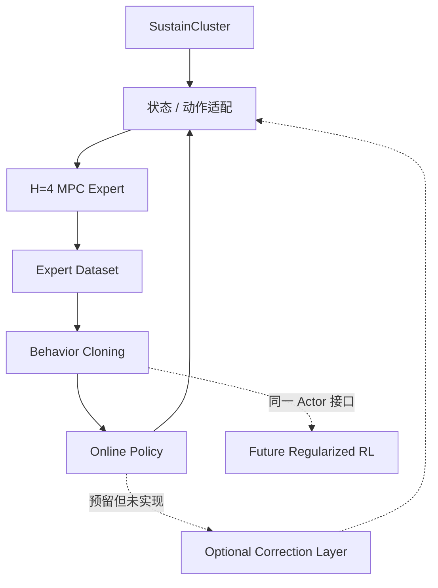

# 数据中心热电耦合建模与 AI 调度

> 基于 SustainCluster 的多数据中心逐任务 AI 调度研究平台，使用 H=4 滚动优化生成专家策略，并以行为克隆策略完成在线闭环调度。

## 当前版本定位

当前版本为 **v0.3.0 Architecture A 发布候选版**，重点验证并固化：

```text
H=4 MPC 专家 → 无泄漏专家数据 → BC 在线策略 → SustainCluster 闭环评价
```

MPC 负责离线教师、优化基线和实验对照；BC 是当前已经验证的在线学习策略。后续带正则约束的 RL 复用同一策略接口，但本轮暂停新算法实验和功能扩展。

## 当前架构



架构状态：

- Architecture A：当前第一版主架构。
- Architecture B：只保留 `Policy → CorrectionLayer → ActionAdapter` 接口位置，不实现真实事件触发逻辑。
- Architecture C：高层 RL + 下层 MPC，仅作为未来研究方向。

## 已实现

- SustainCluster multi-action 环境加载、状态快照和动态动作映射。
- H=1 对照和 H=4 滚动时域 MILP/MPC。
- 专家数据 schema、读写、校验、seed 互斥划分和 oracle 隔离。
- 因果历史预测、稳定特征编码、可行动作 mask。
- BC 训练/检查点/在线推理，以及 BC → SAC actor 权重桥接。
- 5–20 步 MPC/BC 无训练演示。
- 当前参考环境通过 139 项测试，另有 1 项按设计跳过。
- 中文使用、架构、开发和 Git 发布前审计文档。

## 尚未实现

- Architecture B 的真实风险检测与事件触发 MPC 校正。
- Architecture C 的高层 RL + 下层 MPC。
- 将 HVAC、储能和热动态联合控制纳入当前多中心调度主线。
- 经验证的正则化 RL 在线更新；现有 vanilla SAC 只保留负结果复现。

## 环境要求

- Windows PowerShell。
- Python 3.10 或更高版本；当前验证环境为 Python 3.10.11。
- Git。
- 只读第三方环境 SustainCluster，当前验证 commit：`3f6ea95cb835b89ba50b0ef76d66d14b8037643e`。
- 核心依赖：NumPy、Pandas、Gymnasium、SciPy、PyYAML。
- 研究依赖：PyTorch、PyArrow；测试依赖：Pytest。

本项目没有修改 SustainCluster 源码，通过 `src/sustaincluster_mpc/` 和 `src/sustaincluster_imitation/environment_factory.py` 与其交互。

## 快速开始

从 Git clone 开始，依次准备 Architecture A 真正需要的 SustainCluster、Python 环境和 workload：

```powershell
git clone https://github.com/sins1029/ai_system_collaboration.git
cd ai_system_collaboration

# 默认只克隆 SustainCluster，并固定到已验证 commit
powershell -ExecutionPolicy Bypass -File .\scripts\clone_reference_repos.ps1

# 创建独立环境并安装主项目与 SustainCluster 依赖
powershell -ExecutionPolicy Bypass -File .\scripts\setup_env.ps1 -PythonPath python

# 从 SustainCluster 自带的受校验 ZIP 准备 workload
.\.venv-sustain-cluster\Scripts\python.exe .\scripts\prepare_workload.py

# 环境与数据校验
.\.venv-sustain-cluster\Scripts\python.exe -m pip check
.\.venv-sustain-cluster\Scripts\python.exe .\scripts\prepare_workload.py --check
```

`setup_env.ps1` 需要读取 SustainCluster 的依赖清单，因此先准备固定上游仓库，再创建 venv。默认流程不会下载其他四个研究参考仓库；如需完整研究参考集，显式运行：

```powershell
powershell -ExecutionPolicy Bypass -File .\scripts\clone_reference_repos.ps1 -AllReferences
```

SustainCluster 位于其他位置时，可设置 `SUSTAINCLUSTER_ROOT`。路径优先级为 `--sustaincluster-root`、环境变量和项目内默认目录。workload 的来源、SHA256、团队共享文件用法与许可边界见 [数据准备说明](docs/数据准备说明.md)。

## Demo

MPC 运行 5 步闭环：

```powershell
.\.venv-sustain-cluster\Scripts\python.exe .\scripts\run_sustaincluster_demo.py --policy mpc --steps 5
```

BC 运行 5 步闭环，只加载默认检查点、不训练：

```powershell
.\.venv-sustain-cluster\Scripts\python.exe .\scripts\run_sustaincluster_demo.py --policy bc --steps 5
```

输出包含环境加载、数据中心数量、每步当前任务数、策略、完成步数、非法动作、资源越界和平均决策时间。`--steps` 只允许 5–20。

## 测试

```powershell
.\.venv-sustain-cluster\Scripts\python.exe .\scripts\run_tests.py
```

根目录 `pytest` 仅收集 `tests/` 和 `reports/sustaincluster_mpc/`，不会进入外部仓库、数据、PPT 或模型产物目录。当前参考环境结果为 `139 passed, 1 skipped`；跳过项只检查未纳入 Git 的可选专家数据 `split_manifest.json` 是否隔离 oracle，不影响 clean clone 的 Demo 与回归测试。

## 项目目录

- `src/sustaincluster_mpc/`：只读状态适配、语义动作映射、H=1/H=4 优化。
- `src/sustaincluster_imitation/`：路径、数据、预测、特征、BC 与 SAC bridge。
- `scripts/`：最小演示、测试和既有单中心命令。
- `configs/sustaincluster_mpc/`：H=4 默认专家与 H=1 对照。
- `configs/sustaincluster_imitation/`：专家数据、BC 和历史 SAC 配置。
- `tests/`：项目回归与端到端烟测。
- `reports/`：关键研究证据、复现脚本和发布前审计。
- `artifacts/sustaincluster_imitation/`：默认 seed 11 BC 检查点及说明。
- `data/processed/`：本地专家数据，不进入 Git。
- `src/datacenter_env/`：已有单中心热电环境，继续回归但不是多中心默认入口。
- `references/external_repos/`：SustainCluster 是核心运行依赖；其余四个仓库仅供研究参考，均不进入本项目 Git。

## 三人协作建议

- 开发者 A，环境与优化：SustainCluster integration、environment factory、adapter、MPC、constraint、forecast interface 与实现。
- 开发者 B，学习算法：expert dataset、feature encoder、BC、regularized RL、policy，以及 forecast feature 的消费逻辑。
- 开发者 C，实验与评价：runner、metrics、evaluation、plots、regression。

`main` 保持可运行；每人使用短期 `feature/xxx` 分支，完成测试和 code review 后通过 PR 合入。三人都不要长期直接修改 `references/external_repos/sustain-cluster`。

## 当前研究结论

- H=4 稳定、无不可行/非法动作/资源越界，但对普通状态的收益有限，价值集中在部分前瞻场景。
- BC 高保真学习 MPC，真实闭环 SLA 接近 MPC，推理更快，非法动作和资源越界为 0。
- BC 初始化显著优于随机初始化；vanilla SAC 更新会造成专家行为漂移，因此不进入当前默认路线。
- `oracle_upper_bound` 只做上界分析；数据划分按 seed/episode 互斥。

## 已知问题

- 5 步 Demo 是发布烟测，不替代长时域实验。
- seed 11 检查点是本项目使用 `deployable_baseline_forecast` 专家数据训练的 BC 产物，不含第三方预训练模型权重；公开发布仍需结合 SustainCluster 与 workload 数据许可由项目负责人确认。
- 上游 SustainCluster 未来版本可能改变内部字段或相对路径，升级前必须先跑契约测试。
- 历史单中心和 SAC 复现代码仍保留，以保证可复现性；文档已明确其非默认地位。

## 文档

- [使用说明](docs/使用说明.md)
- [数据准备说明](docs/数据准备说明.md)
- [架构说明](docs/架构说明.md)
- [开发说明](docs/开发说明.md)
- [发布候选总报告](reports/pre_git_release/release_candidate_report.md)
