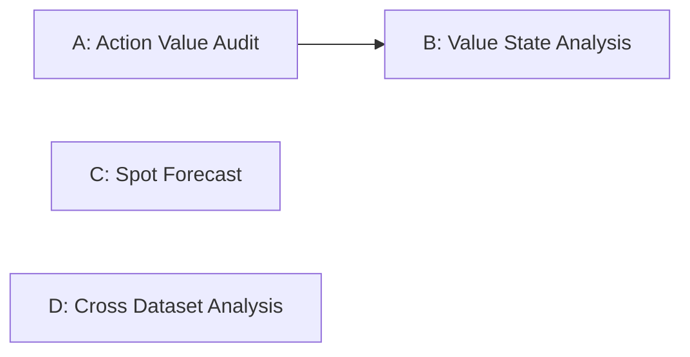

# 下一阶段团队研究任务

当前核心问题：

> 哪些前瞻动作真正值得学习？

本文档定义下一阶段任务边界、依赖关系、分支规则和验收标准。历史里程碑事实保留在 [team_handoff_20260906.md](team_handoff_20260906.md)，本文档作为当前协作计划维护。

## 1. 统一研究基线

### Research experiment milestone

- Milestone commit：`c83515bf977494d5610197dfd2faa9d19af62d46`
- Milestone tag：`research-v3-expert-control-value-20260906`
- 含义：Expert Dataset v3 + Spot control-value baseline 冻结点
- Expert foundation：`MPC EXPERT DATASET v3 READY WITH DOCUMENTED LIMITATIONS`
- Spot control diagnosis：`CONTEXT_DEPENDENT_CONTROL_VALUE`

### Team collaboration baseline

- 协作分支：`feature/baseline-repair-information-contract-v1`
- 上一文档基线：`ec0fab91f88df1076fe50db8040d9bbc8f941f4b`
- 当前协作基线：上述协作分支中包含本次 README / TEAM_TASKS 修订的最新 HEAD
- 精确版本：组员开始任务前执行 `git rev-parse HEAD` 记录；本次修订的最终 commit SHA 由 Git 历史与发布记录给出
- 含义：当前 README + TEAM_TASKS 文档基线

研究 milestone 用于复现实验冻结点；组员实际创建 task branch 时必须从最新 team collaboration baseline 开始，而不是直接从 research milestone tag 开始。

统一研究判断：

1. SpotGPU2026 中 H1/H4 动作分歧明显。
2. 分歧全部来自 placement，当前 H1/H4 defer 均为 0。
3. Oracle H4 并未带来稳定的总体 stage-cost 改善。
4. 下一阶段不能把 exact H4 imitation 直接当作学习目标。
5. 必须先识别 genuinely useful forward-looking actions。

## 2. 任务依赖关系



- A、C、D 可以并行。
- B 可以在 A 完成前搭建 feature extraction、state analysis 和 plotting pipeline。
- B 的正式 state-level counterfactual value label、结论与验收依赖 A。
- 本轮只定义任务，不自动创建任何 task branch。

## 3. 任务 A：H1/H4 分歧动作价值审计

### 基本信息

- Branch：`task/action-value-audit`
- 优先级：P0
- 主要责任边界：独立 action-value analysis

### 研究问题

> H1 与 H4 动作不同时，H4 到底什么时候真正比 H1 好？

### 输入

- Expert Dataset v3 schema
- 已公开的小型 summary / statistics / manifest
- 本地完整 Expert Dataset v3
- frozen objective
- frozen H1/H4 actions
- 已冻结的 capacity、SLA、duration 与信息合同

完整 Expert Dataset v3 只作为本地输入，不进入 Git。

### 任务范围

1. 提取 `H1 joint action != H4 joint action` 的公共 frozen states。
2. 对每个分歧 state 复制两个完全相同的动态 simulator state：
   - Branch A 第一步执行 H1 joint action。
   - Branch B 第一步执行 H4 joint action。
   - 从第二步开始，两边使用完全相同的 common continuation controller。
3. 两个分支必须共享完全一致的 workload、arrivals、true duration、energy signal、carbon signal、SLA、capacity 与 task order。
4. 比较两个分支在相同后续控制条件下的 realized cumulative control cost。
5. 分解 cost components：
   - SLA
   - electricity
   - carbon
   - transmission
   - migration
   - waiting / backlog
6. 报告 `Delta J_K` 的连续分布，并在阈值证据充分时区分 H4 better、near equivalent 与 H4 worse。
7. 选择可复核的典型案例，展示 state、joint action、累计成本分量与判断依据。
8. 任务级结果只用于 attribution / descriptive analysis，不得替代 state-level counterfactual value。

### 主评价协议

Primary value unit：`STATE-LEVEL JOINT ACTION`。

H1/H4 是同一时刻 pending tasks 的联合求解。capacity、queue、migration/transmission 与 reservation coupling 使任务动作不能被独立赋予主 value label。任务级标签的定位必须明确为 `SECONDARY ATTRIBUTION ONLY`。

不能直接用 H4 自身的多步 optimization objective 比较两个 chosen actions，因为不同 horizon 可能使评价天然偏向 H4；也不能只比较 one-step stage cost，因为这会忽略第一步动作的后续影响并可能偏向 H1。主评价必须使用下面定义的共同反事实闭环。

默认 counterfactual horizon：

- 主窗口：`4 steps = 60 min`，与 H4 horizon 对齐。
- 敏感性窗口：`8 steps = 120 min`。
- 敏感性窗口：`16 steps = 240 min`。

不得只报告单一 horizon。

共同后续策略优先级：

1. H1 continuation。
2. 现有 frozen baseline continuation。

不强制实现当前代码中不存在的 controller。若 H1 是唯一稳定且可验证的选择，则在 protocol 中明确记录 `Counterfactual continuation = H1`。无论选择哪一个 controller，两个分支必须使用同一个 controller；禁止 H1-first 分支继续 H1、H4-first 分支继续 H4。

对每个 state 和 `K in {4, 8, 16}` 定义：

```text
Delta J_K =
J_K(H4 first action + common continuation)
-
J_K(H1 first action + common continuation)
```

- `Delta J_K < 0`：H4 first action 更优。
- `Delta J_K ≈ 0`：近似等价。
- `Delta J_K > 0`：H4 first action 更差。

### 分析要求

- 两个 counterfactual branch 必须从相同 frozen state 启动，并独立推进 simulator，不得相互污染。
- 两个分支除第一步 joint action 外，后续 controller 与全部外生输入必须一致。
- 不构造新的综合评分。
- realized cost component sum 必须与 frozen objective 语义一致。
- 连续 gap 分布是主结果，分类只是有依据的辅助结果。
- near-equivalent 阈值不得写死，必须由 solver tolerance、numerical scale 与 metric precision 共同决定。
- 如果阈值证据不足，不强制给出 near-equivalent 硬分类，优先报告连续 gap 分布。
- fixed-state one-step chosen-action gap 只可作为补充诊断，不得作为主 value definition。
- Oracle future 只可用于离线解释，不得进入 deployable input。

### 最低输出字段

- `state_id`
- `h1_joint_action_hash`
- `h4_joint_action_hash`
- `counterfactual_horizon_steps`
- `J_h1_first`
- `J_h4_first`
- `delta_J`
- `stage_cost_delta`
- `sla_delta`
- `electricity_delta`
- `carbon_delta`
- `transmission_delta`
- `migration_delta`
- `waiting_delta`
- `backlog_delta`
- `value_label`
- `continuation_controller`
- `objective_provenance`
- `protocol_provenance`

### 禁止

- 修改 reward 或 objective weights
- 修改 MPC formulation
- 修改 SLA
- 修改 capacity
- 重生成 Expert Dataset v3
- 修改 H1/H4 label
- 训练 BC
- 训练 RL
- 修改 simulator core

### 建议代码边界

- 主要新增：`scripts/analysis/action_value_*.py`
- 可新增：`src/sustaincluster_analysis/` 或等价独立 analysis module
- 可新增：`tests/test_action_value_audit_v1.py`
- 尽量不改 shared dataset schema

### 交付

`artifacts/action_value_audit_v1/`

至少包含：

- `protocol.md`
- `value_gap.csv`
- `component_gap.csv`
- `summary.csv`
- `case_studies.md`
- `final_diagnosis.md`
- `tests.md`

大规模逐任务明细保留本地，只提交汇总级统计。

### 验收

- 可从 frozen v3 复现
- H1/H4 label hash 不变
- frozen objective hash 不变
- 两个分支的初始状态与后续外生序列一致：PASS
- common continuation controller 一致：PASS
- `K = 4 / 8 / 16` 均有报告
- realized cost component sum consistency：PASS
- information leakage audit：PASS
- solver tolerance provenance：明确
- dedicated tests：PASS
- relevant regressions：PASS
- new failures：0

最终必须回答：

1. 在 H1/H4 分歧 state 中，H4 first action 真正改善 4-step realized cost 的比例是多少？
2. 在 8-step / 16-step 下是否稳定？
3. 有多少状态 H4 first action 反而更差？
4. 有多少状态只能视为近似等价？
5. 正收益主要来自 SLA、electricity、carbon、transmission、migration、backlog 中哪些分量？
6. 结论是否依赖 continuation controller？
7. task-level attribution 与 state-level joint value 是否一致？

## 4. 任务 B：前瞻价值状态特征分析

### 基本信息

- Branch：`task/value-state-analysis`
- 优先级：P1
- 正式结论依赖：任务 A

### 研究问题

> 什么样的状态会让前瞻动作真正产生正收益？

### 输入标签

正式分析优先使用任务 A 输出的 state-level counterfactual value：

- state-level value label
- `Delta J_4`
- `Delta J_8`
- `Delta J_16`

task-level attribution 只作为附加解释，不能作为任务 B 的主标签。

在 A 完成前只能搭建不依赖最终标签的处理管线。

### 当前状态特征

- CPU / GPU / Memory pressure
- pending / running / in-transit
- queue composition
- DC residual capacity
- estimated releases
- task priority
- HP / Spot composition
- current electricity price
- current carbon intensity

### 未来解释特征

- +15/+30/+45/+60 min CPU pressure
- +15/+30/+45/+60 min GPU pressure
- +15/+30/+45/+60 min Memory pressure
- future price
- future carbon

未来特征只用于离线解释，不定义为当前可部署信息。

### 任务范围

1. 建立 feature schema 与字段 provenance。
2. 提取与 frozen v3 对齐的 state features。
3. 比较 state-level H4-better / equivalent / worse 三组，并分别检查不同 counterfactual horizon。
4. 使用 train-only 阈值做分位数分层。
5. 报告 descriptive correlation。
6. 报告 conditional statistics。
7. 检查 high-risk 与 ordinary states。
8. 分析 pressure、queue、release、priority、task type 与 energy signal。
9. 可使用轻量解释性模型：
   - logistic regression
   - small decision tree
10. 输出可读规则与失败案例。

### 解释模型边界

- 只作为分析工具。
- 不作为在线 policy。
- 不把 feature importance 表述为因果效应。
- test split 不参与特征阈值或模型选择。
- 需要同时报告性能、稳定性和可解释限制。

### 禁止

- RL
- policy training
- MPC tuning
- reward tuning
- data leakage
- 修改 A 的 state-level counterfactual value label
- 把 Oracle future 当作 deployable feature
- 对连续单轨迹伪造独立样本假设

### 建议代码边界

- 主要新增：`scripts/analysis/value_state_*.py`
- 可新增独立 feature extraction module
- 可新增：`tests/test_value_state_analysis_v1.py`
- 不修改 environment core、MPC solver core

### 交付

`artifacts/value_state_analysis_v1/`

至少包含：

- `protocol.md`
- `feature_schema.md`
- `state_features.csv` 或 `state_features.parquet`，仅本地
- `stratified_summary.csv`
- `correlation.csv`
- `interpretable_model_summary.md`
- `plots/`
- `final_diagnosis.md`
- `tests.md`

### 验收

必须明确回答：

- 哪些因素最能区分 state-level H4 genuinely useful？
- 哪些因素对应 state-level H4 unnecessary 或 harmful？
- 结论是否跨 split 稳定？
- 结论是否跨 `Delta J_4 / Delta J_8 / Delta J_16` 稳定？
- task-level attribution 与 state-level joint value 是否一致？
- 结果是描述性关联还是具有额外识别假设？
- 大型 state feature 数据是否保持本地？

## 5. 任务 C：SpotGPU2026 工作负载预测

### 基本信息

- Branch：`task/spot-forecast`
- 优先级：P1
- 依赖：基本独立，可与 A、D 并行

### 研究问题

> SpotGPU2026 的未来 15 至 60 分钟任务负载能否被可靠预测？

### 数据合同

- 任务数：466,867
- 时间粒度：900 sec = 15 min
- Request scope：`PER_JOB`
- Scenario contract：保持 SpotGPU2026 v1 冻结
- Memory：`MODELED`

### Targets

- `new_task_count`
- `arriving_cpu_demand`
- `arriving_gpu_demand`
- `arriving_memory_demand`

### 时间窗口

- history：96 steps = 24 h
- horizon：4 steps
- +15 min
- +30 min
- +45 min
- +60 min

### Split

- train：70%
- validation：15%
- test：15%
- 严格按时间切分
- scaler、阈值和模型选择仅使用 train / validation
- 禁止 future leakage

### Baselines 与模型

至少包含：

- Persistence baseline
- 现有 Transformer v1 architecture

第一轮固定结构，不进行大规模调参。

固定 seeds：

- 11
- 22
- 33

### 评价

按 target 与 horizon 分别报告：

- MAE
- RMSE
- P90 error

Peak / burst 需要单独报告，不能只给平均 MAE。

还需要检查：

- peak recall 或等价峰值覆盖指标
- burst 时段误差
- 跨 seed 均值与波动
- 与 Alibaba2020 的同指标描述性比较

### 禁止

- 接入 MPC
- 接入 BC
- 接入 RL
- 使用 test 调参
- 修改 Spot scenario contract
- 修改 arrival、duration、request
- 把 modeled memory 写成实测

### 建议代码边界

- 主要修改或新增 forecast-related modules
- 主要新增：`scripts/forecast/*spot_forecast*.py`
- 可复用 `src/forecasting/`
- 可新增：`tests/test_spot_forecast_v1.py`
- 不修改 MPC solver 与 simulator core

### 交付

`artifacts/spot_forecast_v1/`

至少包含：

- `dataset_contract.md`
- `split_manifest.json`
- `persistence_metrics.csv`
- `transformer_metrics.csv`
- `peak_error_analysis.csv`
- `seed_summary.csv`
- `final_diagnosis.md`
- `tests.md`

checkpoints 在本地保存，默认不提交大权重。

### 验收

- split chronology：PASS
- no-future-leakage：PASS
- 4 targets x 4 horizons 完整
- Persistence 与 Transformer 同 split、同预处理
- seeds 11/22/33 完整
- peak / burst 单独评价
- tests：PASS
- new failures：0

最终只能基于预测指标描述 SpotGPU2026 相对 Alibaba2020 更易或更难预测，不能把预测难度混同为调度难度。

## 6. 任务 D：Alibaba2020 / SpotGPU2026 跨数据集分析

### 基本信息

- Branch：`task/cross-dataset-analysis`
- 优先级：P1
- 依赖：可独立开展

### 研究问题

> Alibaba2020 与 SpotGPU2026 在任务结构与调度行为上有哪些描述性差异？

### 分析内容

- arrival task count
- CPU demand
- GPU demand
- Memory demand
- true duration
- estimated duration error
- priority
- queue
- GPU pressure
- risk
- H1/H4 task disagreement
- H1/H4 state disagreement
- defer
- migration
- placement
- 时间波动性
- burstiness

### 比较边界

两套场景容量不同：

- Alibaba2020 使用 repaired frozen scenario
- SpotGPU2026 使用 native 5DC，合计 10,412 GPUs

因此不能声称：

> Spot workload 导致更高 H1/H4 disagreement。

允许的表述是：

> 在各自 source-matched frozen capacity scenario 下，Spot 场景观察到更高动作分歧。

所有比较保持描述性，不将 capacity、workload 和 objective 的共同变化解释为单一因果效应。

### 图表要求

- 生成 PPT-friendly figures。
- 所有正式图保存原始绘图数据。
- 图中注明单位、分母、场景容量和 modeled fields。
- 不把归一化值与物理量混用。
- 不使用综合评分掩盖指标方向差异。

### 禁止

- 修改核心调度代码
- 修改两套 frozen scenario
- 重新缩放容量以制造可比结论
- 删除或抽样任务来匹配分布
- 因果化描述
- 训练 policy

### 建议代码边界

- 主要新增：`scripts/analysis/cross_dataset_*.py`
- 可新增：`tests/test_cross_dataset_analysis_v1.py`
- 尽量不修改 shared modules

### 交付

`artifacts/cross_dataset_analysis_v1/`

至少包含：

- `protocol.md`
- `workload_comparison.csv`
- `pressure_comparison.csv`
- `duration_comparison.csv`
- `behavior_comparison.csv`
- `limitations.md`
- `plots/`
- `summary.md`
- `tests.md`

### 验收

- 两套场景的 source、capacity、time scope 清楚
- 指标单位和分母一致或显式区分
- modeled fields 有标签
- 正式图均有原始数据
- limitations 明确
- tests：PASS

## 7. 推荐分工模式

文档只定义角色，不指定组员姓名。

### 3 人

- Person 1：任务 A
- Person 2：任务 B + D
- Person 3：任务 C

### 4 人

- Person 1：任务 A
- Person 2：任务 B
- Person 3：任务 C
- Person 4：任务 D

### 5 人

第五个角色可以负责：

- integration
- plotting
- documentation
- GPU2026 main trace external validation

第五项不自动启动，必须单独确认研究问题与数据边界。

## 8. Git 协作规则

### 开始任务

```powershell
git fetch origin
git switch feature/baseline-repair-information-contract-v1
git pull --ff-only
git rev-parse HEAD
```

确认 HEAD 是包含本次 README / TEAM_TASKS 修订的最新 team collaboration baseline 后，从当前 HEAD 创建自己的 task branch。Research experiment milestone tag 仅作为实验复现锚点。示例：

```powershell
git switch -c task/action-value-audit
```

其他分支分别为：

- `task/value-state-analysis`
- `task/spot-forecast`
- `task/cross-dataset-analysis`

### 基本规则

- 禁止长期直接修改 `main`。
- 禁止长期直接修改 `feature/baseline-repair-information-contract-v1`。
- 每个任务使用独立 branch。
- 每个任务使用独立 artifacts root。
- 每个任务增加独立 tests。
- 每个任务通过独立 PR 进入集成审查。
- 不 force push 共享分支。
- 不修改第三方 `references/external_repos/sustain-cluster` 源码。

### 每个 PR 必须说明

- 研究问题
- 输入数据与许可边界
- frozen contracts
- 新增或修改文件
- 输出 artifacts
- 测试命令与结果
- 已知限制
- 是否涉及 shared modules
- 是否包含大型或受限数据

## 9. 代码责任边界

### A

主要新增：

- `scripts/analysis/action_value_*`
- 独立 analysis module
- 对应 tests

### B

主要新增：

- `scripts/analysis/value_state_*`
- feature extraction / plotting pipeline
- 对应 tests

### C

主要修改或新增：

- `src/forecasting/`
- `scripts/forecast/*spot_forecast*`
- 对应 tests

### D

主要新增：

- `scripts/analysis/cross_dataset_*`
- figure source data
- 对应 tests

所有任务尽量不修改：

- environment core
- MPC solver core
- shared dataset schema
- frozen scenario contracts

如果必须修改共享模块：

1. 在 PR 中说明原因。
2. 将共享修改放入独立 commit。
3. 补充受影响模块的回归测试。
4. 通知其他并行任务处理冲突。

## 10. Artifacts 与公开数据规则

不得 push：

- 原始 Alibaba traces
- SpotGPU2026 `job_info` / `node_info`
- Alibaba GPU2026 原始 trace
- 大型 Parquet / NPZ / PKL
- 完整 task-level / state-level Expert Dataset
- privileged future
- 大型 checkpoints / model weights
- 包含本地个人路径或凭据的产物

可以提交：

- protocol
- schema
- small summary CSV
- aggregate statistics
- manifest / hash
- information leakage audit
- tests record
- limitations
- final diagnosis
- plot source summary

SpotGPU2026 派生数据 public redistribution permission 为 `NOT_CONFIRMED`。任何新的派生数据在公开前必须再次审计粒度、体积和许可。

## 11. 统一验收清单

每个任务结束前至少检查：

- [ ] 基于统一 milestone
- [ ] 未改变无关 frozen contract
- [ ] 输入数据 hash / provenance 已记录
- [ ] train / validation / test 边界清楚
- [ ] Oracle 与 deployable information 已隔离
- [ ] 指标单位、方向和分母清楚
- [ ] 未构造未经定义的综合评分
- [ ] 大型产物保持本地
- [ ] secrets / personal paths scan 通过
- [ ] compileall 通过
- [ ] dedicated tests 通过
- [ ] relevant regressions 通过
- [ ] full pytest 无新增失败
- [ ] Git staged diff 只包含任务范围
- [ ] PR 明确记录限制与下一步

## 12. 集成顺序

建议集成顺序：

1. A 完成 action-value label 与阈值审计。
2. C、D 可在 A 期间独立完成并提交 PR。
3. B 先提交不依赖 label 的管线，正式结论在 A 合并后更新。
4. 集成审查确认 action-value 证据后，再决定是否启动 lightweight policy。

在 action-value audit 完成前，不启动：

- exact H4 imitation
- 新 BC 训练
- 新 RL 训练
- forecast-to-policy integration
- MPC/reward tuning
