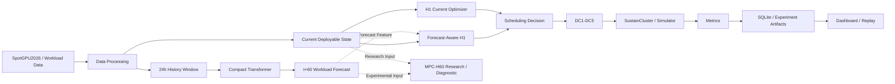

# 总体架构

## 系统视图



`H1 Current Optimizer` 是当前稳定基线。`Forecast-Aware H1` 为 `EXPERIMENTAL / UNDER VALIDATION`。`MPC-H60` 只作为研究和诊断分支，最新 action-value audit 不支持把它设为默认控制器。

本机未检测到 `mmdc` 或 Mermaid CLI，因此本轮保留 GitHub 可直接渲染的 Mermaid 源，不额外安装 Node 工具。

## 数据与控制边界

1. Data Processing 将原始任务转换为冻结的时间、资源、SLA 和五 DC 场景合同。
2. Compact Transformer 只读取 96 个历史 step 和已知日历特征，输出 `t+60` workload forecast。
3. H1 只读取当前可部署状态，不使用 oracle future 或 `true_duration`。
4. `true_duration` 仅属于 simulator truth，用于推进任务生命周期。
5. Oracle future 只允许进入离线专家、诊断和上界评估。
6. 决策、仿真和指标可写入 SQLite；大规模训练样本保留为 Parquet。

## 模块职责

### `src/datacenter_env/`

- 单数据中心热电环境与安全约束。
- 任务 arrival、waiting、running、completion 生命周期。
- Gymnasium 适配、控制器和评估指标。
- SQLite 数据持久化。

### `src/sustaincluster_mpc/`

- 多数据中心 current state 与 action adapter。
- H1 current-only optimizer 和历史 H4 支持。
- MPC-H60 terminal optimizer 与 Oracle、Learned 信息边界。
- Forecast pressure、future signal、timeline 和 Triggered MPC 支持。
- Forecast-Aware H1 只有在独立验证后才能成为稳定接口。

### `src/sustaincluster_imitation/`

- Expert Dataset schema、reader、writer 和 collector。
- 历史 BC、SAC warm-start 与 offline policy 实验。
- Structured Current State 表示和 identifiability audit。
- 这些历史学习模块不是当前默认在线控制器。

### `src/forecasting/`

- Forecast dataset 和时间窗口。
- Compact Transformer、训练、推理与评估。
- `h60_dataset.py` 和 `h60_models.py` 提供 Spot `t+60` 冻结实验支持。

### `scripts/`

- `clone_reference_repos.ps1`、`setup_env.ps1`：协作环境。
- `audit/`：数据、信息、容量和 formulation 审计。
- `forecast/`：forecast dataset、训练和历史 forecast-aware MPC。
- `imitation/`：expert dataset 与历史学习实验。
- `competition/`：MPC-H60 Night 1/Night 2 与 value audit 入口。

### `artifacts/`

`artifacts/` 保存实验摘要、metrics、manifest 和本地大产物。它不是源码目录。只有经过许可与大小审计的小型 summary、CSV、JSON 或 Markdown 才能进入 Git。

## 当前控制路线

```text
稳定在线基线：Current State -> H1 -> Scheduling Decision

开发中路线：Current State + t+60 Forecast
            -> lifecycle-aware future-risk correction
            -> Forecast-Aware H1

研究诊断路线：Current State + terminal t+60 information
            -> MPC-H60
            -> common-continuation value audit
```

当前 H60 验证结论为 `H60_VALUE_NOT_SUPPORTED`。这表示 terminal t+60 信息在当前 objective 和 scenario 下没有形成跨 split 稳定净收益，不表示 workload forecast 本身不可预测。
