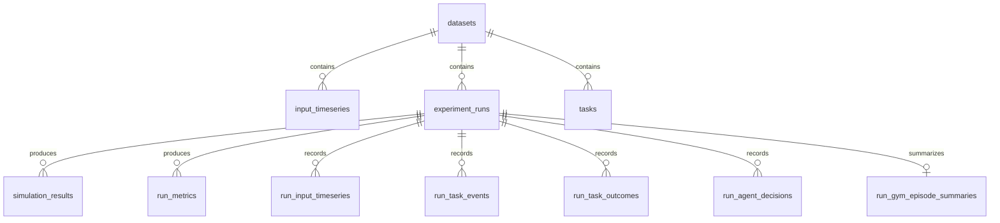

# 数据库说明

## 当前实现

- 数据库：SQLite
- schema version：`4`
- 权威 schema：`src/datacenter_env/storage/schema.sql`
- 版本常量：`src/datacenter_env/storage/database.py` 中的 `SCHEMA_VERSION = 4`
- 运行存储：`SQLiteRunStore`
- 无持久化模式：`NullRunStore`

`initialize_database()` 执行 schema、兼容旧库迁移，并把版本写入 `schema_versions`。连接建立时启用 `PRAGMA foreign_keys = ON`。

## 实体关系



`schema_versions` 是独立的迁移记录表。`run_task_events.task_id` 与 `run_task_outcomes.task_id` 在业务上引用任务标识，但当前 schema 没有对 `tasks` 建立 SQL 外键，不能把它描述为数据库强制关系。

## 表说明

| 表 | 用途 | 主键 | 关键字段 | 外键 |
|---|---|---|---|---|
| `datasets` | 数据集注册、来源和时间范围 | `id` | `name`、`source_path`、`time_step_minutes`、`signal_source`、`metadata_json` | 无 |
| `input_timeseries` | 数据集级原始/标准化输入时序 | `(dataset_id, timestamp)` | load、price、carbon、temperature、renewable | `dataset_id -> datasets.id`，级联删除 |
| `experiment_runs` | 每次实验的配置、Git、控制器和状态 | `id` | `scenario`、`controller_name`、`dataset_id`、`seed`、`git_commit`、`config_json`、`status` | `dataset_id -> datasets.id` |
| `simulation_results` | 每个仿真 step 的热、电、成本、资源和任务状态 | `(run_id, step_index)` | `timestamp`、power、temperature、objective、utilization、task counts | `run_id -> experiment_runs.id`，级联删除 |
| `run_metrics` | run 级标量指标 | `(run_id, metric)` | `metric`、`value` | `run_id -> experiment_runs.id`，级联删除 |
| `run_input_timeseries` | 某个 run 实际消费的外生输入快照 | `(run_id, step_index)` | workload、electricity、carbon、temperature、renewable | `run_id -> experiment_runs.id`，级联删除 |
| `tasks` | 数据集级任务定义 | `(dataset_id, task_id)` | arrival、duration、CPU/GPU/memory、deadline、priority、deferrable | `dataset_id -> datasets.id`，级联删除 |
| `run_task_events` | arrival/start/defer/complete 等任务事件 | 无显式主键 | `run_id`、`step_index`、`timestamp`、`task_id`、`event_type`、`details_json` | `run_id -> experiment_runs.id`，级联删除 |
| `run_task_outcomes` | 每个 run 的任务最终结果 | `(run_id, task_id)` | final status、wait、deferral、SLA、lateness、resource blocked | `run_id -> experiment_runs.id`，级联删除 |
| `run_agent_decisions` | Gym/agent 决策及 reward 分解 | `(run_id, decision_step_index)` | simulation step、candidate task、action、mask、reward | `run_id -> experiment_runs.id`，级联删除 |
| `run_gym_episode_summaries` | 每个 run 的 Gym episode 汇总 | `run_id` | episode reward、decision/simulation steps、invalid actions、termination | `run_id -> experiment_runs.id`，级联删除 |
| `schema_versions` | 已应用 schema 版本 | `version` | `applied_at` | 无 |

## 写入流程

1. `SQLiteRunStore.initialize()` 创建或迁移数据库。
2. `create_run()` 确保 dataset 存在并创建 `experiment_runs`。
3. `append_transition()` 在 savepoint 内原子写入 run 输入、仿真 step、任务及任务事件。
4. `append_agent_decision()` 记录 agent action 和 reward component。
5. `finish_run()` 写入任务 outcomes、run metrics 和 completed 状态。
6. `fail_run()` 保存错误并标记 run failed。

## 查看数据库

默认单中心数据库路径来自 `configs/experiment.yaml`：

```text
data/db/single_center.sqlite
```

使用仓库脚本：

```powershell
.\.venv-sustain-cluster\Scripts\python.exe .\scripts\inspect_database.py .\data\db\single_center.sqlite
```

脚本会显示数据集、run、时序、任务、决策、schema version 及最近 run 的健康指标。

## SQLite 与 Parquet

SQLite 用于运行记录、仿真结果、任务事件、metrics 和 Dashboard replay。Parquet 用于 SpotGPU2026 Expert Dataset v3、模型训练和大规模离线分析。

不要把完整大规模 Parquet 导入 SQLite。Dashboard 应读取 SQLite 和小型 summary/manifest；训练管线继续直接读取本地 Parquet。
