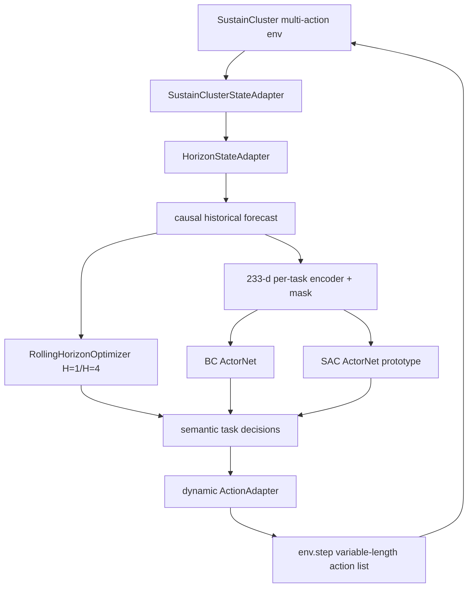

# 当前实现审计

审计日期：2026-08-18

## 1. 版本与工作区

- 主项目分支：`feature/single-center-task-runtime-v0.2`
- 主项目 `HEAD`：`d49870b9d9fbee4b480100f4a64d74075b0e1a8b`
- 主项目状态：无 tracked 文件修改；`artifacts/`、SustainCluster configs、processed data、`reports/`、两个新 source 包、相关 tests 等均为 untracked。
- SustainCluster：`main@3f6ea95cb835b89ba50b0ef76d66d14b8037643e`，工作区干净。
- 本轮没有切分支、commit、修改外部仓库、训练模型或运行新实验。

这意味着当前研究结果存在于工作区，但没有被当前 Git 提交固定。报告中的“已实现”均指当前磁盘事实，不等同于“已合入版本历史”。

## 2. 两套项目范围

根 `README.md` 与 tracked `src/datacenter_env/` 仍描述单数据中心热电环境、单中心任务队列和 Gymnasium 调度。最新 SustainCluster 研究线则位于：

- `src/sustaincluster_mpc/`
- `src/sustaincluster_imitation/`
- `configs/sustaincluster_mpc/`
- `configs/sustaincluster_imitation/`
- `reports/sustaincluster_mpc/`
- `reports/sustaincluster_imitation/`
- `data/processed/sustaincluster_expert/`
- `artifacts/sustaincluster_imitation/`

两条线目前共处同一工作区，但没有统一根文档、版本边界或正式 package metadata。此次架构决策只针对 SustainCluster 多中心任务调度线；thermal/HVAC/storage 不进入当前架构判别。

## 3. 当前真正可运行的闭环



目前没有 event trigger、risk detector、MPC correction wrapper 或 high-level RL→MPC 接口。

## 4. SustainCluster 动作接口

原 YAML 为 `single_action_mode=true` 且 defer disabled。外部 runner 深拷贝配置并在内存中设置：

- `single_action_mode=false`
- `disable_defer_action=false`
- `strategy=manual_rl`
- `use_tensorboard=false`

multi-action 模式的动作列表必须与 `env.current_tasks` 等长。环境动作不是稳定 `dc_id`，而是 reset 后 datacenter 字典顺序的位置；defer enabled 时 `0=defer`，其余是位置加一。`SustainClusterActionAdapter` 每次 reset 后重建 `dc_id→position action`，并校验 task ID、original index、数量、类型与范围。

## 5. 状态与环境生命周期

当前实现区分：

- `env.current_tasks`：等待全局调度决策；
- `env.deferred_tasks`：下一 step 重新进入 current tasks；
- `env.in_transit_tasks`：已路由但尚未到目的中心；
- `dc.pending_tasks`：到达目的中心但等待本地容量；
- `dc.running_tasks`：正在执行并有 release time。

每个环境 step 为 15 分钟。动作后先进入传输，至少到下一环境 step 才可进入目的中心；目的中心按 FIFO 尝试资源调度。当前外部快照包含任务需求、deadline、资源、价格、碳、传输成本/延迟和已知 reservation。缺口包括 future-arrival 公共接口、链路容量/拥塞、完整 defer 历史和部署级不确定性接口。

## 6. MPC 实现

`RollingHorizonOptimizer` 使用 SciPy `milp`/HiGHS。变量数为：

```text
J × D × H + J
```

其中 `x[j,d,h]` 表示任务在时域第 h 步派发到 d，附加 J 个 terminal-backlog 二元变量。当前显式约束包括：

- 每个任务恰好派发一次或进入 terminal backlog；
- CPU/GPU/memory 容量；
- duration 跨时段占用；
- transmission 到达后才能执行；
- completion deadline；
- running/queued/in-transit/future aggregate reservations；
- 不允许执行起点落在 horizon 外；
- defer disabled 时只允许当前步派发。

目标包含 electricity、carbon、transmission、waiting/defer、SLA risk、terminal backlog。H=1 与 H=4 expert configs 除 horizon 外完全相同，使用 `no_future_arrivals`，权重为 `1/1/1/100/10/100`。

限制：future arrivals 只按 origin 聚合预留、不是未来逐任务路由；DC FIFO 没有被完整复制；没有 network congestion、thermal/HVAC/storage、chance constraints 或 robust MPC。

## 7. BC 实现

当前 BC 复用 SustainCluster `ActorNet`：

- 每任务 feature dimension：233；
- semantic actions：`defer, dc_1..dc_5` 共 6 类；
- hidden size：256；
- LayerNorm；
- 参数量：128,262；
- 训练：weighted masked cross entropy，12 epochs，3 seeds；
- 输入 DC 顺序按稳定 `dc_id`，不使用环境位置编码；
- 训练主数据只使用 causal `deployable_baseline_forecast`，排除 oracle。

`feasible_action_mask` 会检查单个任务的 transfer、deadline 与该任务在目的中心的 horizon 容量占用；defer 始终允许。它不对同一步所有任务的联合选择做总容量约束。因此：

- 动作编码合法性可由 mask + adapter 保证；
- 环境本身不会让 available resource 变成负数，而会把过量任务留在 DC queue；
- 当前闭环零 overflow 是真实结果，但不是任意 OOD 状态下的联合可行性证明。

## 8. SAC warm-start 实现

当前脚本实现离散 per-task SAC 原型：

- random actor 与 BC actor；
- 配对 seed 使用相同随机 critic 初始化；
- 10,000 environment steps；
- replay capacity 128，max tasks 2048，batch 8；
- warmup 128，update frequency 16，actor every 2 updates；
- `gamma=.99, alpha=.01, tau=.005`；
- 执行动作时应用 feasible mask；
- replay/update 存储的是 task occupancy mask，不保存每动作 feasibility mask，SAC loss 中的 action logits 没有使用可行动作 mask。

最后一点是实现事实，但尚无消融证明它是退化原因。

## 9. Reward 与评估不一致

SustainCluster 当前 `reward_config.yaml` 只启用：

- energy price，weight 0.9；
- carbon emissions，weight 0.3。

SLA penalty、timeliness 与 transmission cost 没有启用。SAC 训练/评估 reward 因此不直接奖励 SLA 保持或低 migration/transmission，而报告又将 SLA 单独作为核心安全指标。这是明确的目标接口不一致，也是需要实验验证的可能退化解释；不能在没有消融时把它写成唯一因果结论。

## 10. 当前系统与设想边界

已实现：

- multi-action 环境运行；
- 冻结状态与动态动作适配；
- one-step/rolling MPC；
- causal forecast；
- expert dataset；
- BC 训练、离线评估、真实闭环；
- BC→SAC 权重桥与 vanilla SAC warm-start 原型。

未实现：

- regularized SAC / expert replay / frozen actor critic warmup；
- OOD/confidence/risk detector；
- event-triggered MPC 调用与 correction；
- high-level fixed-dimensional RL intent；
- RL→MPC constraint/reference/weight interface；
- full-time hierarchical controller；
- thermal/HVAC/storage/renewable 联合控制。

## 11. 当前验证

本轮只运行低风险测试：

```text
tests/
reports/sustaincluster_mpc/test_one_step_scheduler.py
reports/sustaincluster_mpc/test_rolling_horizon_optimizer.py
```

结果：`138 passed in 45.24s`。单独聚焦 imitation + MPC 的首次核验为 `45 passed in 48.26s`。没有运行训练或实验生成脚本。

