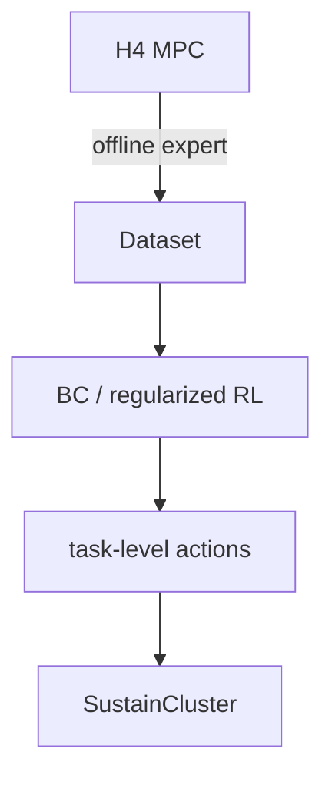
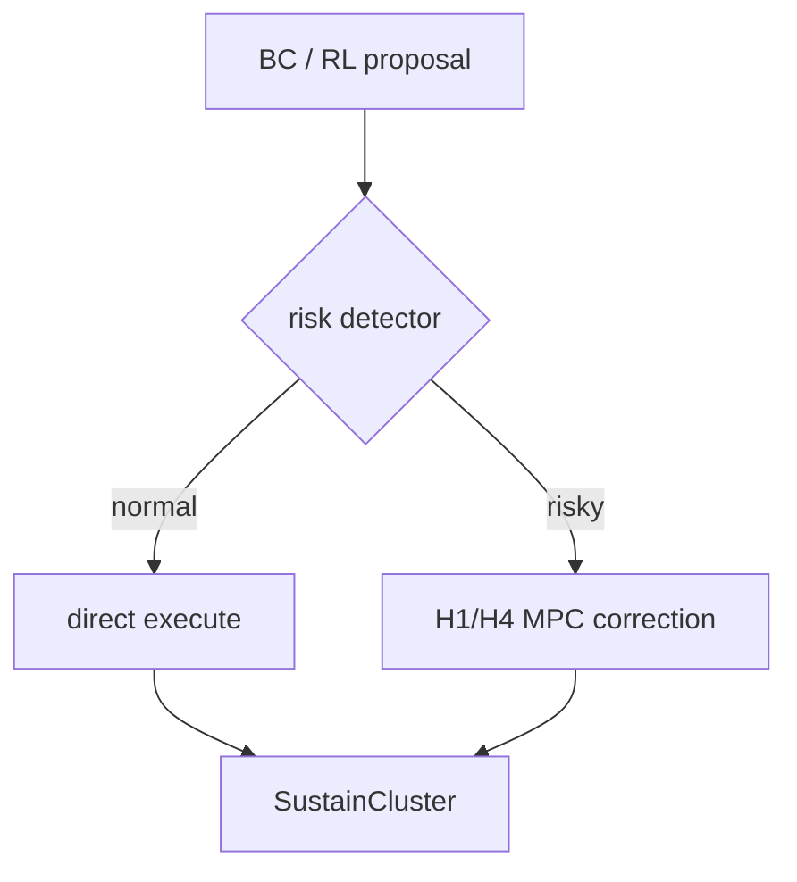
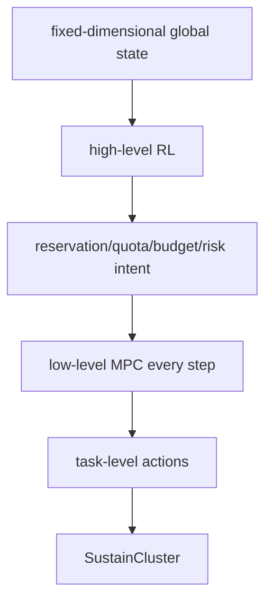

# ai_system_collaboration 项目逻辑审计与技术架构决策报告

审计日期：2026-08-18
项目：`ai_system_collaboration`
外部环境：`references/external_repos/sustain-cluster`

## 执行摘要

当前 SustainCluster 研究线真正解决的是：在多数据中心中，对动态到达的 AI/GPU 任务逐任务决定 defer 或目的数据中心，并同时评估 CPU/GPU/memory、SLA、electricity、carbon、transmission、transfer delay 与 migration。

研究链已经完成到：

```text
multi-action interface
→ one-step / rolling MPC
→ H1/H4 fair comparison
→ causal MPC expert dataset
→ Behavior Cloning
→ real BC closed loop
→ BC-initialized SAC warm start
→ vanilla SAC drift
→ architecture decision
```

最重要的正结论是：MPC→BC 不仅能把优化器动作高保真压缩进神经网络，还已经能让 BC 独立控制真实 multi-action SustainCluster；MPC expert 也显著改善了 RL 初始化。最重要的负结论是：最新公平比较没有证明 H=4 每步在线的必要性，当前 vanilla SAC 又无法稳定保留 BC 行为。

当前按直接证据排序，Architecture A 最强；按下一步最值得验证的架构假设排序，Architecture B 领先。Architecture C 的 low-level MPC 可行，但 high-level RL 尚未定义出经实验证明有价值的决策权。

## 1. 当前研究问题

当前研究对象不是 SustainCluster 本身，也不是根仓库已有的单中心 thermal package。它是当前工作区中新形成的多中心研究线：

> 在多数据中心环境下，对 AI/GPU 任务在不同时间与不同数据中心之间进行逐任务调度，决定每个 pending task 是 defer 还是路由到某个目的 DC，并综合资源、SLA、能源、碳和网络代价。

代码与该问题大体一致：

- task：CPU、GPU、memory、duration、bandwidth、arrival、deadline；
- environment：current/deferred/transit/DC-pending/running/completed；
- spatial action：defer 或稳定语义 `dc_id`；
- cost/metrics：electricity、carbon、transmission、migration、SLA、delay；
- MPC：对上述主要资源与时序约束显式建模；
- learned policy：逐任务输出动作。

但“综合考虑”不应误写成所有算法使用同一个完整 reward。当前 SAC 的真实环境 reward 只启用 electricity price 和 carbon emissions，SLA/transmission 没有进入训练 reward；它们只在评估或 MPC objective 中出现。链路容量/拥塞也尚未建模。

另一个项目治理事实是：根 `README.md`、`pyproject.toml` 和当前 Git `HEAD` 仍主要描述单中心热电/任务队列包；SustainCluster MPC、BC、datasets、artifacts 与 reports 全部是 untracked。当前研究事实已经前进，但版本化项目叙述尚未同步。

## 2. 项目为什么从 SustainCluster 开始

SustainCluster 提供了多数据中心任务调度所需的环境机制：

- workload 与 task arrivals；
- CPU/GPU/memory resource state；
- DC price 与 carbon intensity；
- defer、network transmission、DC queue、execution 与 resource release；
- SLA statistics、reward 与 `env.step()`。

本项目不改 SustainCluster，而是在其外部研究 scheduler：

```text
state snapshot
    ↓
scheduler
    ↓
one decision per current task
    ↓
dynamic semantic-action adapter
    ↓
SustainCluster environment
```

外部 SustainCluster 当前保持 `main@3f6ea95c` 且 Git clean。它应在论文中被定义为实验环境/benchmark substrate，而不是创新算法。

## 3. multi-action RL 的核心困难

### 3.1 single-action

`single_action_mode=true` 将动态任务集合聚合成固定 observation，actor 输出一个离散动作并广播到全部任务。这使 PPO/APPO 等标准 RL 容易使用，但同一步内 GPU demand、SLA、duration、bandwidth 和 origin 不同的任务无法得到不同路由。

### 3.2 multi-action

`single_action_mode=false` 返回动态长度的 per-task observations，并要求动作列表与 `env.current_tasks` 等长。它才是真正逐任务调度，却引入：

- 动态 task-set 长度；
- 组合动作空间快速增长；
- task matching 与共享 capacity 耦合；
- defer、SLA、migration、transfer 与长期收益同时学习；
- Gym space 只描述单任务 `Discrete`，不描述完整联合动作。

所以本项目最初真正的问题是：

> 如何保留 multi-action 的逐任务能力，同时减少 RL 直接从随机探索学习基础约束和组合调度规律的难度？

## 4. 为什么引入 MPC

MPC/rolling MILP 可以把已有知识写成变量、约束与可解释目标：

- 每任务只选择一次；
- CPU/GPU/memory joint capacity；
- duration 跨时段占用；
- SLA completion deadline；
- defer 与 terminal backlog；
- migration、transmission cost/delay；
- running release 与 queued/in-transit reservation；
- future price/carbon/capacity/arrival information。

初始假设因此是：

> 先让模型优化器承担基础可行性和调度知识，再把其 state→action 规律迁移给 AI，是否能使 multi-action RL 更容易开始？

这直接产生 `MPC → expert → BC → RL` 路线。

## 5. 已完成研究链

| 阶段 | 问题 | 当前答案 |
|---|---|---|
| 环境与动作适配 | multi-action 能否真实执行？ | 能；动态 DC order、空任务、task/action order 均验证。 |
| one-step optimizer | 显式优化器能否逐任务调度？ | 能；真实闭环稳定。 |
| rolling horizon | 能否表达 future release/price/arrival？ | 能；H=1/2/4/8 skeleton 已实现。 |
| horizon value | H4 是否比 H1明显好？ | 仅特定场景明确；多数公平场景近似。 |
| expert data | 是否能生成可部署而非 oracle 数据？ | 能；causal primary dataset 与 oracle 物理隔离。 |
| BC | 网络能否学会 expert？ | 能；路由与 migration 指标也高。 |
| BC closed loop | 能否不调用 MPC 运行真实环境？ | 能；5 fresh seeds 已验证。 |
| SAC warm start | expert 是否改善 RL 起点？ | 是；初始 reward/SLA/agreement 明显改善。 |
| SAC fine-tune | vanilla SAC 能否继续改善？ | 当前否；expert behavior 漂移。 |
| architecture decision | MPC 最终角色是什么？ | 仍待最小判别实验。 |

## 6. H=1/H=4 给出的信息

最新公平比较只改变 horizon，每个场景 5 seeds、96 steps：

| 场景 | H=1 | H=4 | 结论 |
|---|---|---|---|
| capacity release | wait 2，defer 66.7%，cost 1644.66 | wait 1，defer 50%，cost 829.24 | H4 明确有用。 |
| future low price | 所有关键指标相同 | 同 H1 | 无增益。 |
| GPU burst | completed 32，SLA 16，wait 17.67 | 完全相同 | 无增益。 |
| high-load trace | SLA 2477.4，cost 1118410.21 | SLA 2480.8，cost 1118407.44 | 成本几乎相同，SLA 略差。 |
| normal trace | SLA 936.0，cost 462675.74 | SLA 936.2，cost 462708.47 | 基本相同，stage cost 还略高。 |

旧构造压力实验仍证明 H4 能在已知 future burst、低价窗和 capacity release 下改变正确动作，但其 one-step/rolling 口径不同，部分使用 oracle，只能作为机制能力证明。

计算成本在 real traces 上平均提高到 2.31–2.80 倍；BC closed-loop harness 中 H4/H1 为 20.51/6.76 ms，即 3.03 倍。公平比较最大 H4 solve time 29.60 ms，只占 15 分钟周期约 0.0033%。所以：

- H4 的相对开销确实更高；
- 绝对开销不是实时瓶颈；
- 不能仅凭 BC 更快淘汰 MPC；
- 也不能凭 MPC 足够快证明它必须永久运行。

客观结论：

> 当前证据仅支持 H=4 是有效的预测优化器和专家基线，并不能证明每一个调度时刻都必须使用 H=4。

## 7. MPC expert dataset

primary `deployable_baseline_forecast` 数据：

- 80 episodes；
- 7,680 steps；
- 256,125 task-actions；
- defer ratio 68.376%；
- local/migration（assign 内）26.208%/73.792%；
- GPU task 70.284%；
- SLA urgent 79.967%；
- solver failure 0；
- seed-exclusive 60/20/20 episode split；
- oracle in primary train = 0；
- test 有 unseen burst intensity。

causal baseline forecast 只使用当前与历史 observations。`oracle_upper_bound` 和 `deployable_no_future` 独立存放，不进入主 BC split。

MPC expert dataset 的意义不只是“有很多样本”，而是把显式的 joint optimization 结果转成稳定语义 `defer/dc_id` 标签，为 learned policy 提供了避免随机探索的起点。

## 8. BC 给出的信息

BC 学习：

```text
每一步在线求解 MPC
        ↓
state-action dataset
        ↓
ActorNet 学习 state → task action
```

也就是把优化器决策规律压缩进 128,262 参数、233-d input、6-action 的 per-task network。

三 seed test：

- overall accuracy：96.981% ± 0.141%；
- top-2：99.622% ± 0.066%；
- defer F1：99.991%；
- assign accuracy：90.492% ± 0.446%；
- migration F1：94.790% ± 0.316%。

overall accuracy 会被 68.4% defer 类占比抬高；永远 defer 就有约 68.4% accuracy。因此 assign accuracy 与 migration F1 更关键：它们说明网络确实学到了具体 DC 路由和跨中心决策，而不仅是学会 defer。

### 8.1 BC 真实闭环

5 个未用于 train/validation/test 的 fresh seeds，normal/high-load trace 交替，每个 episode 96 steps：

| Policy | Reward | Completed | SLA | Defer | Migration | Electricity | Carbon | Transmission | Illegal / overflow | Inference ms |
|---|---:|---:|---:|---:|---:|---:|---:|---:|---:|---:|
| H4 MPC | -1797.51 | 3512.0 | 1552.6 | 74.96% | 50.98% | 14786.32 | 45277.91 | 101.23 | 0 / 0 | 20.513 |
| H1 MPC | -1796.68 | 3512.0 | 1553.0 | 74.96% | 51.45% | 14834.58 | 45338.38 | 100.70 | 0 / 0 | 6.764 |
| BC | -1866.31 | 3512.2 | 1552.8 | 74.96% | 53.85% | 14736.78 | 45082.71 | 119.86 | 0 / 0 | 4.076 |
| random actor | -2439.22 | 3506.6 | 1597.6 | 76.78% | 77.83% | 14693.80 | 45496.13 | 340.51 | 0 / 0 | 4.197 |
| original local-only rule | 0* | 3551.6 | 0* | 0% | 0% | 15275.27 | 46706.79 | 0 | 0 / 0 | 0 |

`*` local-only 的 routing 发生在 cluster manager 内，`TaskSchedulingEnv` 传给 reward/SLA 接口的 current task list 为空，因此 reward/SLA 零值不可解释为无成本或无违约。

由此回答五个关键问题：

1. **BC 不是只在离线分类正确。**它已经不调用 online MPC，连续生成 variable-length actions 并驱动真实环境。
2. **BC 与 H4 的差距在 completed、SLA 和物理联合成本上很小。**completed +0.2、SLA +0.2，`electricity+carbon+transmission` 比 H4 低 0.376%。
3. **BC 更好的指标：**completed 略高、electricity 低 49.54、carbon 低 195.20、联合物理成本略低、inference 快约 80.1%。
4. **MPC 更好的指标：**H4 reward 高 68.81、SLA 少 0.2、transmission 低约 18.4%、migration 低 2.88 个百分点。
5. **4 ms vs 20 ms：**BC 推理快是算法优势，但 20 ms 的 H4 远小于 15 分钟周期，不能仅凭速度淘汰 MPC。

还需注意：per-task mask 不做整批 joint capacity，环境 queue 会阻止负资源，所以当前零 overflow 是已测闭环事实，不是任意 OOD 下 SLA/联合可行性保证。

## 9. SAC warm-start 给出的信息

3 个 paired seeds、10k interactions：

| Group | Initial reward | Initial SLA | Initial agreement | Threshold steps |
|---|---:|---:|---:|---:|
| random-init | -3641.44 ± 765.59 | 966 | .7796 | 666.7 |
| BC-init | -1821.22 ± 0 | 936 | .9256 | 0 |

BC step-0 std 为 0，是因为相同 BC checkpoint 和 evaluation seed 被重复评估，不是跨分布零方差。即便如此，paired comparison 仍清楚证明：

> MPC→BC 显著改善 RL 初始化和初始策略质量。

更新后 BC-init reward -2432.21、SLA 2080、agreement .7690。已经确定的是 expert agreement↓、SLA↑、reward↓；未确定的是具体原因。

critic cold start、entropy、Q bias、reward mismatch、replay distribution、online shift、catastrophic forgetting、loss 未使用 per-action feasible mask等只能列为 possible explanations。当前结果不支持“RL 不能直接执行”，只支持“当前 vanilla SAC recipe 不保留 BC”。

## 10. 当前真正的架构矛盾

当前证据同时给出三件事：

1. MPC 是稳定的 joint-constraint scheduler 和 teacher；
2. BC 在已测常态下已经接近 H4，可直接执行；
3. RL online update 又可能破坏专家行为。

所以真正问题不是“用 MPC 还是 RL”，而是：

> MPC 应只做离线 teacher，按风险触发做 online corrector，还是每步作为 low-level executor？RL 应直接拥有 task action，还是只拥有 fixed-dimensional intent？

## 11. Architecture A — Direct BC / Regularized RL



| Interface | Definition |
|---|---|
| Observation | 动态 per-task 233-d features + masks。 |
| Action | 每任务 defer/DC。 |
| Frequency | 15 min。 |
| MPC role | teacher/benchmark，online 否。 |
| RL role | direct executor。 |
| Hard constraints | adapter + per-task mask；当前无联合 task-set guarantee。 |
| Training | BC 已实现；regularized SAC 未实现。 |
| Fallback | 未实现，需 safe rule 或 optional MPC。 |

证据：BC offline/closed-loop/warm-start 强支持；vanilla SAC drift、OOD 与联合容量缺口削弱 pure A，但没有否定 regularized A。

## 12. Architecture B — Event-Triggered MPC



| Interface | Definition |
|---|---|
| Observation | A 的 features + confidence/OOD/capacity/SLA/forecast risk。 |
| Action | task-level proposal；trigger 后由 MPC 替换。 |
| Frequency | detector 每 15 min；MPC 条件调用。 |
| MPC role | corrector + teacher/benchmark。 |
| RL role | 处理多数 normal states。 |
| Hard constraints | normal 路径同 A；trigger 路径 joint constrained。 |
| Training | actor + calibrated detector；均未实现 trigger 部分。 |
| Fallback | solver failure 时 H1/conservative defer rule。 |

B 受现有结果强烈动机支持：BC 常态够好、H4 价值状态依赖、vanilla RL 有漂移。但它没有直接 call-rate/correction 实验，不能写为已验证。

## 13. Architecture C — High-Level RL + Low-Level MPC



合理的 high-level outputs：

- per-DC resource reservation；
- admission quota；
- migration budget；
- backlog/defer target；
- risk margin。

弱候选是只调 dynamic objective weights，因为这可能缺乏真实决策权并退化成自动调参。最小原型应明确为 7-d `[5×GPU reserve, migration budget, backlog target]`，由 MPC 保证 CPU/GPU/memory/SLA/transfer hard constraints。

C 的 low-level MPC 与 latency 已验证，但 high-level observation/action/value 完全未验证。BC≈H4 还反向提出永久 executor 是否必要。因此 C 当前不是主线。

## 14. Evidence Matrix

| Evidence | A | B | C | 限制 |
|---|---|---|---|---|
| BC offline accuracy 高 | strong | strong | neutral | defer 类占比高，但 assign/migration 排除了主要混淆。 |
| BC real closed loop ≈ H4 | strong | strong | raises question | 仅 5 fresh seeds、normal/high-load。 |
| BC illegal/overflow=0 | moderate | moderate | neutral | per-task mask 不等于联合容量安全。 |
| H4≈H1 in many fair scenarios | supports teacher-only possibility | strong motivation | weakens permanent H4 | future events 覆盖有限。 |
| capacity release H4 明确改善 | neutral | strong | moderate | 单一合成场景。 |
| H4 latency 足够 | neutral | supports triggered use | strong technical feasibility | 可运行不等于必要。 |
| SAC warm start 改善 | strong | strong | weak | 证明 actor init，不证明 final RL。 |
| vanilla SAC drift | weakens vanilla A | motivates safety correction | neutral/weak | 原因未消融。 |
| MPC joint constraints 稳定 | teacher support | corrector support | executor support | 模型仍有缺口。 |
| trigger 未实现 | neutral | direct evidence low | neutral | B 尚是假设。 |
| high-level interface 未实现 | neutral | neutral | direct evidence low | C 只验证了一半。 |

## 15. MPC 在最终系统中的可能角色

| Role | 状态 | 判断 |
|---|---|---|
| Benchmark | 已验证 | 数学优化强基线和统一 reference。 |
| Expert Teacher | 已验证 | 当前最强角色；BC 与 warm-start 直接支持。 |
| Safety/Correction Layer | 部分验证 | MPC 有纠正能力，但 trigger/call-rate 未验证。 |
| Permanent Executor | 部分验证 | 技术上可行，必要性未证明。 |

回答“为什么还需要 MPC”：当前最确定的理由是 benchmark 和 teacher；未来可能是 selective safety layer。不能用 20 ms 很小来证明 permanent executor，也不能用 BC 4 ms 来淘汰 MPC。

## 16. RL 在最终系统中的必要性

当前已经证明：

- expert policy 可被神经网络压缩；
- learned actor 可直接运行；
- expert initialization 让 RL 从更好的起点开始。

当前尚未证明：

- RL online learning 超过 frozen BC 或 MPC；
- RL 在 model mismatch/OOD 中更适应；
- RL 的长期 value 带来新增收益；
- high-level RL intent 优于 fixed objective MPC。

stochasticity、model mismatch、forecast uncertainty、dynamic objectives 和 large-scale inference 是理论理由，不是现有实验结论。若 Phase 1 后 RL 仍不能在这些方面提供增益，就应把贡献收缩为 expert distillation/selective optimization，而不是强行保留 RL 标签。

### 16.1 更准确的研究问题候选

1. **RQ1：**Can model-based expert knowledge improve the trainability of fine-grained multi-action RL scheduling?
2. **RQ2：**Can a learned task-level policy replace most online MPC decisions while retaining SLA and resource feasibility?
3. **RQ3：**Can event-triggered MPC correction achieve a better safety-computation tradeoff than pure learned scheduling or full-time MPC?
4. **RQ4：**Does high-level RL plus low-level MPC outperform fixed-objective MPC under forecast error and workload distribution shift?

RQ1 拥有最多已完成实验基础，并已有阶段性肯定答案；RQ2 最容易形成连贯论文主线，因为 BC direct closed loop 已建立起点；RQ3 是当前最值得新增的核心判别问题，也对应领先候选 B；RQ4 目前缺少 high-level action 与直接证据，应作为备选而非当前主线。

## 17. 已经确定的事实

1. SustainCluster 是环境，scheduler 才是研究对象。
2. multi-action 是正确的任务级 action abstraction。
3. 动态 environment action mapping 已解决。
4. MPC 可稳定做逐任务联合约束调度。
5. H4 具前瞻能力，但非普遍必要。
6. causal expert data 已形成且无 oracle leakage。
7. BC 真正学到 assignment/migration，不只是 defer。
8. BC 已真实 direct closed loop。
9. MPC→BC 显著改善 RL initialization。
10. vanilla SAC 会导致当前 BC behavior drift。
11. 当前 reward 与 SLA/transmission 存在接口错位。
12. B/C 尚未实现。

## 18. 尚未确定的问题

- regularized A 能否稳定并超过 BC；
- direct policy 的 OOD/联合容量安全；
- B 的 trigger recall、MPC call rate 与 correction 收益；
- H1 是否足够充当大多数在线 corrector；
- C 的 high-level action 是否有独立 signal；
- MPC 是否需要永久在线；
- RL 是否能在 distribution shift 下胜过 fixed MPC；
- SAC 退化各可能原因的因果贡献。

## 19. 最小架构判别实验

### Experiment 1：Regularized direct RL

- **Research question：**A 是否仍可行？
- **Compared：**frozen BC、vanilla BC-init SAC、BC/KL-regularized SAC、可选 critic warmup。
- **Controlled：**同 actor/critic/features/reward/10k steps/paired seeds。
- **Metrics：**reward、SLA、agreement、costs、illegal/overflow、shift window。
- **Decision：**final reward 不差于 BC、SLA ≤BC+1%、agreement≥.90、illegal/overflow=0 才保留 A。

### Experiment 2：Event-trigger MPC

- **Research question：**B 能否低调用率保持 full H4？
- **Compared：**BC、full H4、BC+simple trigger、oracle-trigger upper bound。
- **Controlled：**同 BC/checkpoint/forecast/seeds/H4 config；actor 不训练。
- **Metrics：**quality/safety + call rate、trigger precision/recall、corrected ratio、latency。
- **Decision：**call rate≤20%、SLA/cost 与 H4 差≤1%、risky recall≥95%、stress 优于 BC。

### Experiment 3：Minimal high-level intent

- **Research question：**C 的高层 action 是否有价值？
- **Compared：**fixed H4、best grid intent、scripted oracle intent、7-d high-level RL。
- **Controlled：**同 low-level MPC/hard constraints/forecast/seeds，weights 不任意缩放。
- **Metrics：**quality、action variance/saturation、decision disagreement、MPC feasibility/latency、shift performance。
- **Decision：**scripted upper bound 先显示≥1%收益，RL 再捕获该方向且 SLA 不恶化，C 才继续。

## 20. 推荐的下一阶段路线

### Architecture decision status

```text
Recommended current architecture:
  frozen BC direct execution baseline + H4 MPC teacher/benchmark，暂不宣称最终架构。

Leading candidate:
  B — Event-Triggered MPC，medium confidence。

Alternative:
  A — BC-regularized direct RL，medium confidence。

Not yet justified:
  C — High-Level RL + permanent MPC，low confidence；
  以及每个时刻都必须 H4，low confidence。
```

### Phase 1 — Architecture Decision

只完成 Experiment 1/2/3 的最小版本，先决定 A/B/C。当前最合理的工作不是继续扩大训练，而是完成 architecture-discriminating experiments。

### Phase 2 — Algorithm Development

只开发胜出架构对应算法：regularized SAC、trigger mechanism 或 hierarchical interface，避免三线并行扩张。

### Phase 3 — Robustness / Generalization

验证 unseen workload、capacity changes、forecast errors、DC scale/order/heterogeneity、price/carbon shift 与 solver/model failures。

### Phase 4 — Physical / Energy Extension

最后才扩展 thermal、HVAC、storage、renewable 与中国 electricity/carbon data。它们不是当前架构决策重点。

## 当前系统与候选系统逻辑图

### Current implemented system

```text
SustainCluster multi-action env
    ↓ read-only adapters
Horizon state + causal forecast
    ├─ H1/H4 Rolling MPC ───────────┐
    └─ 233-d encoder → BC/SAC actor ├─ semantic task decisions
                                    ↓
                      dynamic ActionAdapter
                                    ↓
                         SustainCluster env.step
```

BC direct、H1/H4 与 vanilla SAC prototype 已实现；它们是并列实验路径，不是一个 event-trigger/hierarchical system。

### Architecture A

```text
offline H4 MPC → expert data → BC/regularized RL
                                  ↓
                         task-level actions → env
```

### Architecture B

```text
BC/RL proposal → risk detector ─ normal → env
                       └──── risky → MPC correction → env
```

### Architecture C

```text
global fixed state → high-level RL intent → low-level MPC every step
                                             ↓
                                      task-level actions → env
```

后两张图是候选设计，不是当前已实现系统。

## 审计与验证记录

- 当前主项目：`feature/single-center-task-runtime-v0.2@d49870b`；
- SustainCluster：`main@3f6ea95c`，clean；
- 本轮低风险回归：`138 passed in 45.24s`；
- 未运行 training、dataset generation、fair comparison 或 closed-loop experiment entry points；
- 未修改算法代码、SustainCluster、Git branch 或 commit。

本轮没有继续开发新算法，只完成项目逻辑审计与架构决策分析。
